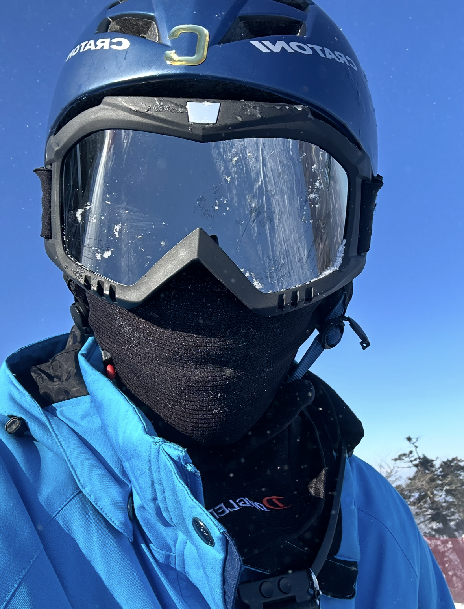
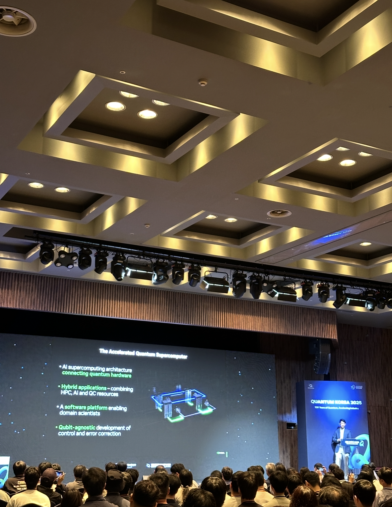
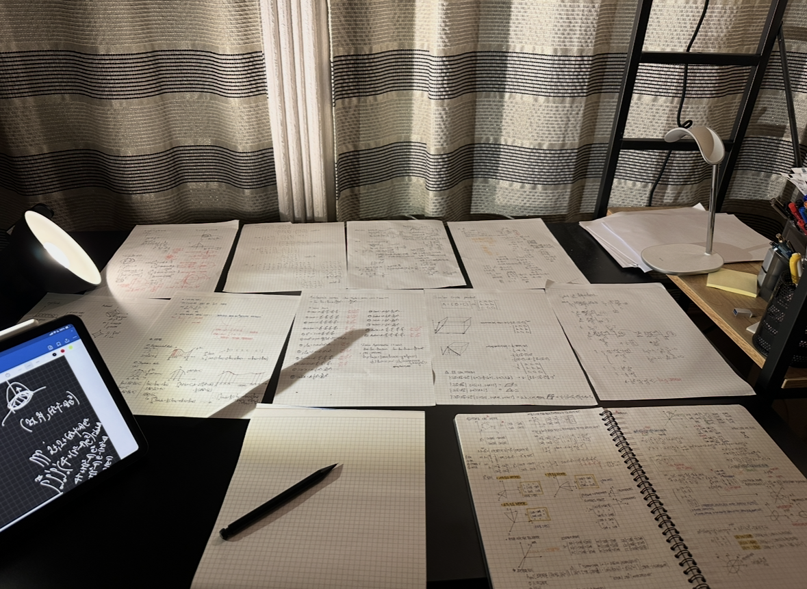
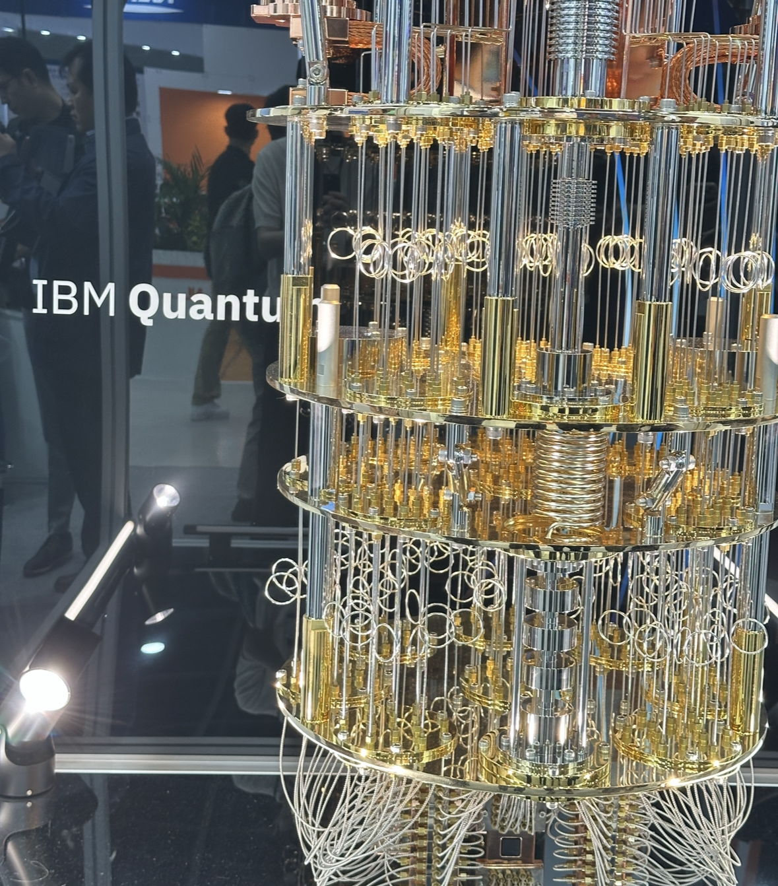
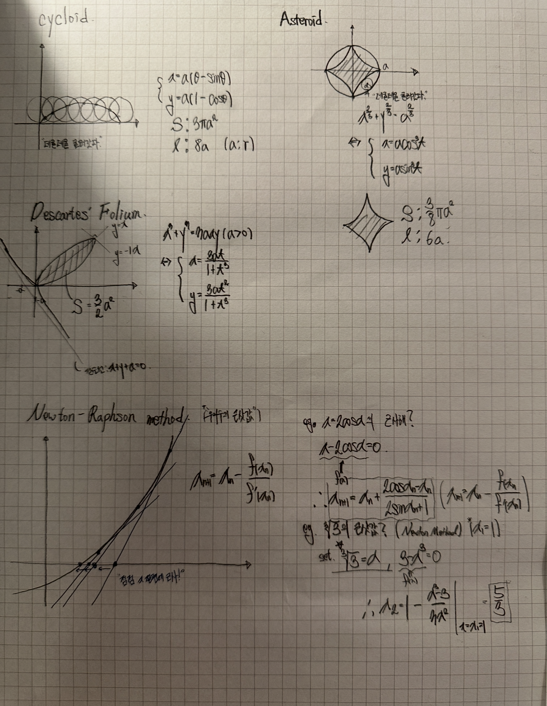
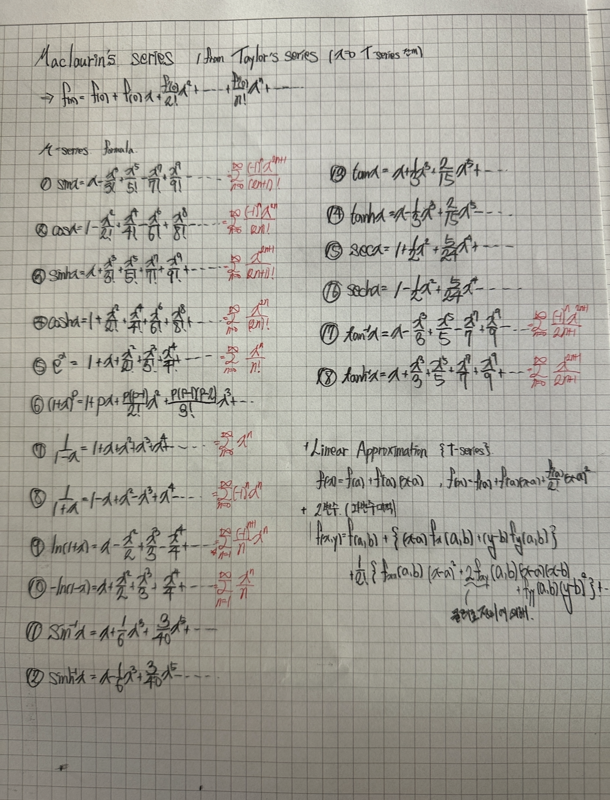

<table border="0" width="100%">
    <tr>
        <td width="60%" valign="center">
            <h1>Hi there, I'm Eunsu101</h1>
            
            

                <em>"Exploring the intersection of Classical Deep Learning and Quantum Artificial Intelligence"</em>
            

             
            
            
        </td>
        <td width="40%" align="center" valign="center">
            
             
            
        </td>
    </tr>
</table>

 

## Research Interests

<table border="0" width="100%">
    <tr>
        <td width="60%" valign="top">
            
I am focusing on **Deep Learning optimization** and the potential of **Quantum Machine Learning (QML)**.

            <table>
                <thead>
                    <tr>
                        <th>Domain</th>
                        <th>Key Topics</th>
                    </tr>
                </thead>
                <tbody>
                    <tr>
                        <td>**Deep Learning**</td>
                        <td>• **ANN Architecture** • **Optimization Algorithms** • **Regularization**</td>
                    </tr>
                    <tr>
                        <td>**Quantum AI**</td>
                        <td>• **VQC** (Variational Quantum Circuits) • **QNN** (Quantum Neural Networks) • **SVM + Quantum Kernel** • **Quantum Embedding**</td>
                    </tr>
                </tbody>
            </table>
        </td>
        <td width="40%" align="center" valign="top">
            
             
            
            
        </td>
    </tr>
</table>

 

## Tech Stack

### Languages & Frameworks
   

### Data Science & Math
  

 

## Mathematical Proficiency

My study is grounded in a strong mathematical foundation:

* **Linear Algebra**: Vector spaces, Matrix decomposition, Eigenvalues/Eigenvectors.
* **Multivariable Calculus**: Gradients, Partial derivatives for Backpropagation.
* **Probability & Statistics**: Stochastic processes, Bayesian inference, Statistical modeling.

 

## Personal Interests

Beyond research, I find inspiration in:
* **Skiing**
* **Classical Music**

 

    
    
     
    
    

 
