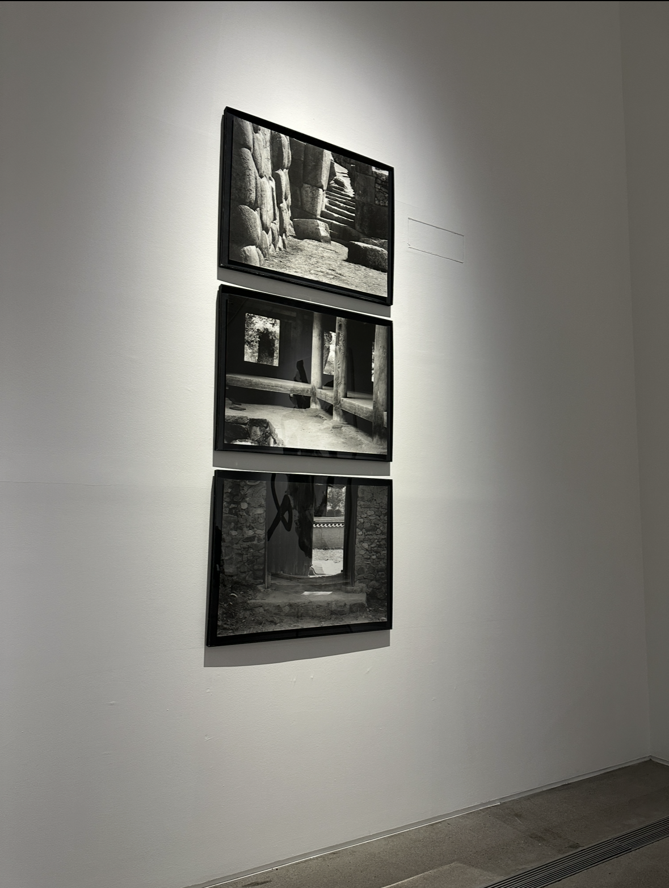

# Hi there, I'm Eunsu101

  <em>"Exploring the intersection of Classical Deep Learning and Quantum Artificial Intelligence"</em>

 

 

## Research Interests

I am focusing on **Deep Learning optimization** and the potential of **Quantum Machine Learning (QML)**.

| **Domain** | **Key Topics** |
| :--- | :--- |
| **Deep Learning** | • **ANN Architecture** • **Optimization Algorithms** • **Regularization** |
| **Quantum AI** | • **VQC** (Variational Quantum Circuits) • **QNN** (Quantum Neural Networks) • **SVM + Quantum Kernel** • **Quantum Embedding** |

 

## Tech Stack

### Languages & Frameworks
   

### Data Science & Math
  

 

## Mathematical Proficiency

My study is grounded in a strong mathematical foundation:

* **Linear Algebra**: Vector spaces, Matrix decomposition, Eigenvalues/Eigenvectors.
* **Multivariable Calculus**: Gradients, Partial derivatives for Backpropagation.
* **Probability & Statistics**: Stochastic processes, Bayesian statistics.

 

## Personal Interests

Beyond research, I find inspiration in:
* **Skiing**
* **Classical Music**

 

  
  
  

 

